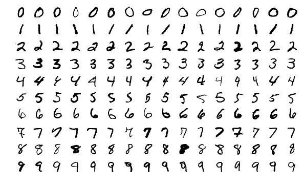

# MNIST Dataset for WEKA

The MNIST database of handwritten digits for [Weka](https://www.cs.waikato.ac.nz/ml/weka/)

|Download|Converter|License|Issues|
|---------|---------|---------|----------|
|  |  |  | |

## About this project
During year 2018 I had to work on MNIST dataset using Weka. Unfortunately, the dataset was provided in a non-standard format (IDX) and required a converter in order to open it with Weka. I've looked around the web in order to find a premade converter, but the ones available on the [Weka Sourceforge page](https://sourceforge.net/projects/weka/files/datasets/MNIST/) didn't work and were updated in year 2005 (13 years ago).
I found [a converter written in Java](https://github.com/aywi/hdr-mnist-weka/blob/master/src/hdr/mnist/weka/MNISTPreprocessing.java), but it was really slow (10 minutes of processing on a Intel Core i7 3770 - 16GB Ram), so I decided to write my own version in C. The performance improvement is massive (from 10 minutes to 6-10 seconds, depending on SDD/HDD).
I'll provide here both the dataset and the converter, so you can choose either to build your own Weka dataset starting from the files provided on the [THE MNIST DATABASE of handwritten digits](http://yann.lecun.com/exdb/mnist/) page or download the already converted dataset and immediately using it with Weka.

## Converter
* Compitation
  
  `gcc -Wall -Wextra -O3 mnist_784.c -o mnist_784` 

  **-O3 (optimization level) is mandatory**, Segmentation Fault otherwise 

* Usage

  `mnist_784 <dataset name> <dataset labels> <dataset images> <output-file-name>`

  e.g. `mnist_784 train train-labels-idx1-ubyte train-images-idx3-ubyte train.arff`
  
Tested on Ubuntu 16.04 and Windows 10 build 1809 under Windows Subsystem for Linux (using Debian GNU/Linux 9.0)

## Resources

* THE MNIST DATABASE of handwritten digits: http://yann.lecun.com/exdb/mnist/ (IDX specifications at the bottom of this page)
* Weka ARFF File Format Specifications: https://www.cs.waikato.ac.nz/ml/weka/arff.html

## Acknowledgements

**PhD Yuanyuan Wei** ([aywi](https://github.com/aywi) @ github.com) for his work on a Java converter, which was used as a base for this converter

**Josef Steppan** ([j05s](https://github.com/j05t) @ github.com) for the image at the top of this README
